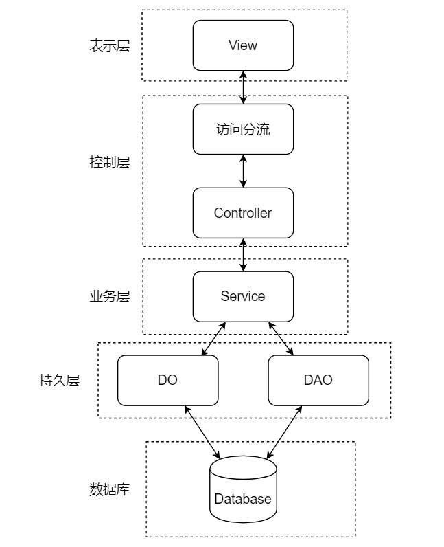

# 总体架构设计

系统根据不同功能划分成不同模块，各模块在进一步划分，各个模块可以独立并行开发，为不同的子模块之间降低耦合性，各模块之间通过接口进行关联调用。衡量模块独立性的标准是耦合性和内聚性。耦合性，也称块间联系，用来度量软件系统结构中各模块之间相互联系的紧密程度。模块之间联系越紧密，耦合性就越强，模块的独立性就越差。内聚性，又称为块内联系，用来衡量模块的功能强度，也就是一个模块内部的各个元素之间彼此结合的紧密程度。如果一个模块内各元素联系得越紧密，则它的内聚性就越高。为软件系统进行模块划分时，要尽量做到高内聚和低耦合，从而提高模块的独立性。

系统总体架构图如下：

架构说明如下：

1. 表示层：网页端的表示层主要为使用 Vue.js 制作的界面，用户可以通过浏览器进行访问，访问时表示层向控制层传送参数，将信息传递给控制层。业务逻辑处理后，处理结果将返回给表示层进行展示，实现交互。
2. 控制层：控制层接受来自表示层的信息和请求，将请求分发到业务层不同的模块进行处理，处理后返回结果。同时控制层也承担着对表示层访问请求的分流工作。
3. 业务层：业务层在控制层和持久层中间，调用持久层，又被控制层调用，起一个承上启下的作用，非常关键。系统的结构耦合度较弱，层与层之间的依赖是向下的，上层设计的改变对底层的调用不会有影响。
4. 持久层：持久层采用 Mybatis 框架。Mybatis 提供强大的动态 SQL 功能，将 JDBC 接口封装起来，并通过 mapper 配置文件与数据库相连接，利用 Java 的注解和映射功能进行数据库实例化。Mybatis 可以通过 SqlSessionFactory 对象生成 SqlSession 实例，执行 mapper 中的 SQL 语句。SqlSessionFactory 对象可以通过 XML 配置文件生成或通过 Mybatis 的 Resource 对象构建。